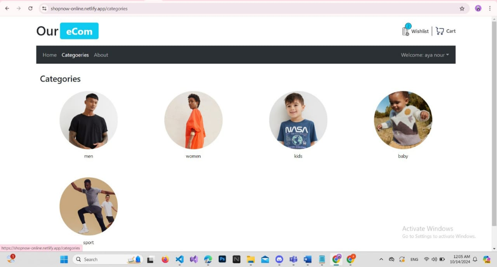

# E-commerce Web Application

This is a full-featured e-commerce web application built with React, designed for practice and learning. The project includes various functionalities and optimizations for enhanced user experience and performance.



## Features

- **Add to Favorites**: Users can save products to their favorites list.
- **Add to Cart**: Users can add products to their shopping cart and adjust quantities as needed.
- **Order Management**: Users can place orders after adding items to the cart.
- **API Integration**: Products are fetched dynamically from an API.
- **Authentication and Authorization**: Users can register, log in, and access protected routes using React Hook Form with Zod for validation.
- **Error Handling**: Includes error handling and loading states for better UX.
- **Performance Optimizations**: Various design patterns are used to reduce rendering and enhance performance.

## Technologies Used

- **React**
- **Redux**
- **TypeScript**
- **Bootstrap**
- **React Hook Form** with **Zod** for form validation
- **API Integration**
- **Design Patterns for Performance**

## Setup Instructions

To run this project locally, follow these steps:

### 1. Clone the repository

```bash
git clone https://github.com/AyaNour333/E-commerce_Web_Application.git
cd E-commerce_Web_Application

```
### 2. Install dependencies

```bash
npm install

```
### 3. Start the development server

```bash
npm run dev

```
### 4. Open the project in Visual Studio Code

```bash
code .

```
### 5. Running the Backend Locally
To run the backend locally, follow these additional steps:

- Take the **ecommerce-backend** folder (which contains the API) out of the main project folder to a separate location.
- Decompress the folder if needed.
- Inside the backend folder, run:


```bash
npm install
npm start
